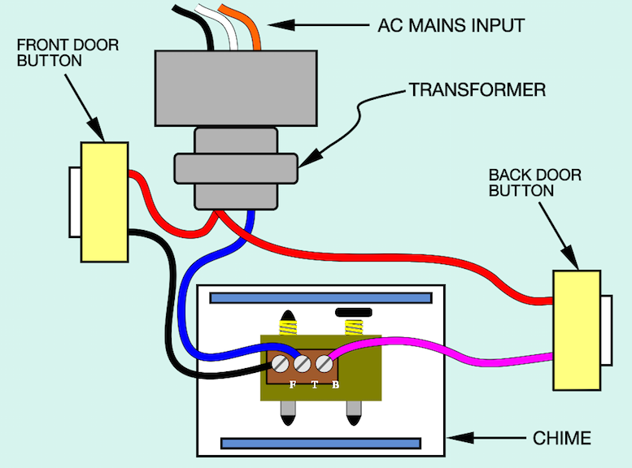

author: Derek Carter aka "goozbach" <derek@goozbach.com>
title: Smart; Dumb Doorbell
subtitle: With Rasberry Pi
footer: Derek Carter
subfooter: http://presentation.goozbach.com/
company: Goozbach Infrastructure Solutions LLC

# how does a doorbell work?
* AC => AC transformer 120v to ~16v
* buttons close circuit
* electromagentic actuator hits chime

!SLIDE standard_doorbell 

# Hardware
* Raspberry Pi Zero W
* Some sort of relay board
* Doorbell chime with transformer
* Conduit box with plug

# software
* RPi.GPIO library -- managed GPIO pins from the Pi
* Urllib library -- Send events to other URLs
* Flask library -- Simply create REST interface

# Wiring
* Connect chime to relay board
* Connect relay board to Pi GPIO pins
* Connect doorbell buttons to Pi GPIO pins
  * Be aware of lighted buttons (AC vs DC issues)
  * Add resistors!
    * "Pull Up"
    * "Pull Down"

!SLIDE button_wiring

# Hardest part of this project?
### Reading resistor codes

# Step One -- Ring the chime
* Create a REST interface which rings the chime.
* Wrap rest interface in testing HTML/AJAX

# Step Two -- Get button presses
* Event handler for buttton presses
* Don't forget to wire properly
* Debouncing

# Step Three -- Connect button press events
* Use some sort of IoT like software
  * Pico-Engine
  * NodeRED
  * Lambda
* Going to leave this as an exercise for the reader

# Lessons Learned
* It always takes longer than you think.
* Don't put your GPIO ribbon cable on backwards
  * Female header is better (you can plug right into breakout board)
* Don't over-torque your transformer's plastic threads
* It's hard to fit a USB plug, lightswitch, transformer leads and big wire nuts into a 2-gang conduit box
* 12Ga Solid copper wire *WILL* cut you!
